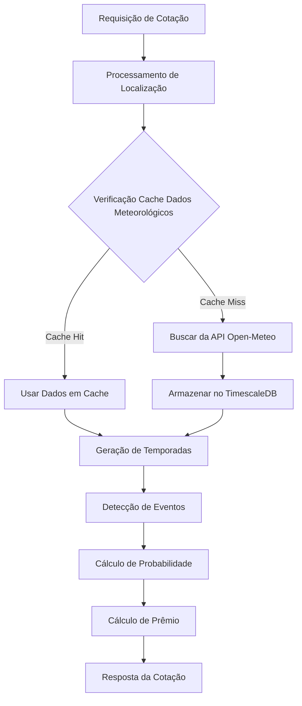
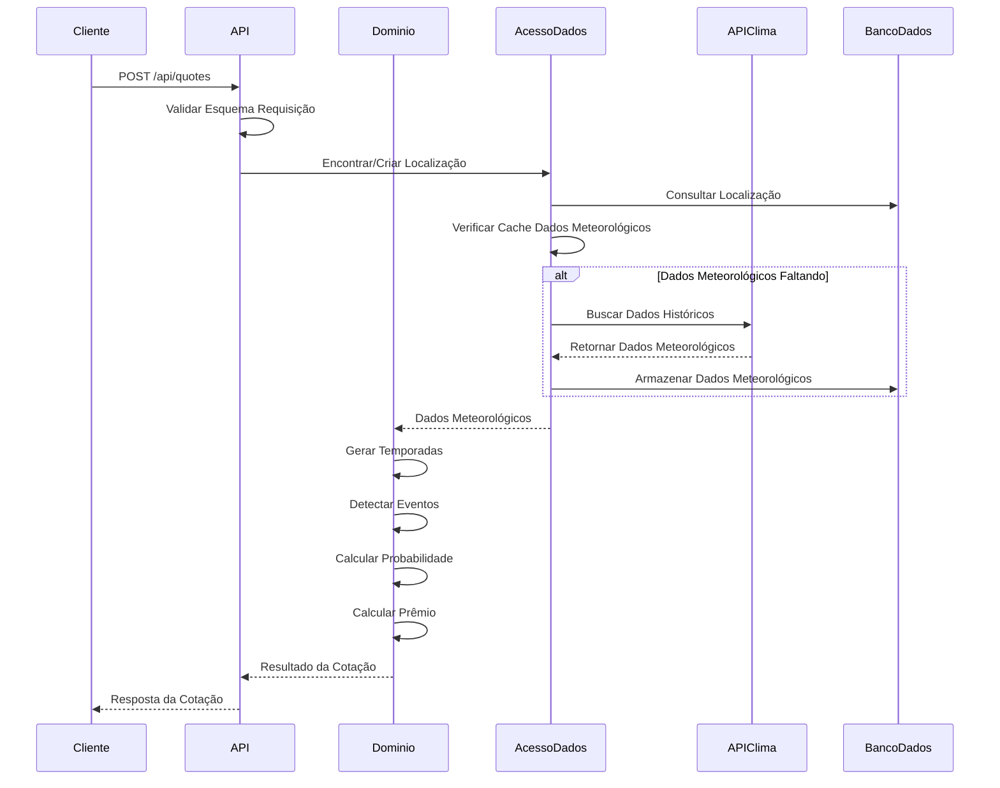
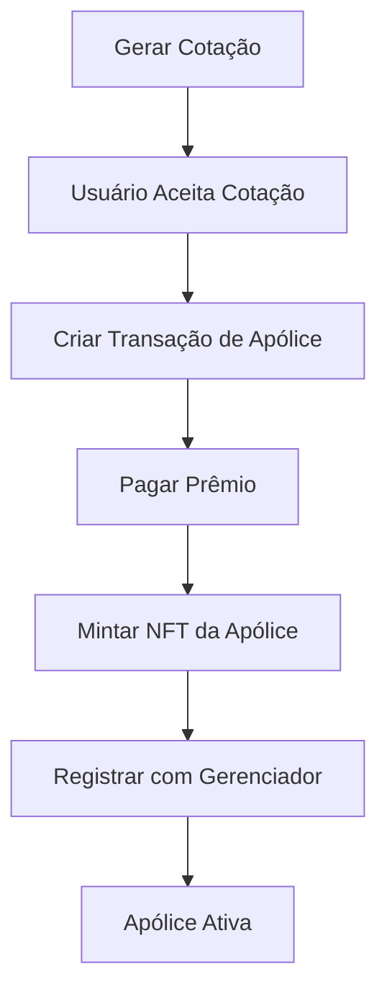
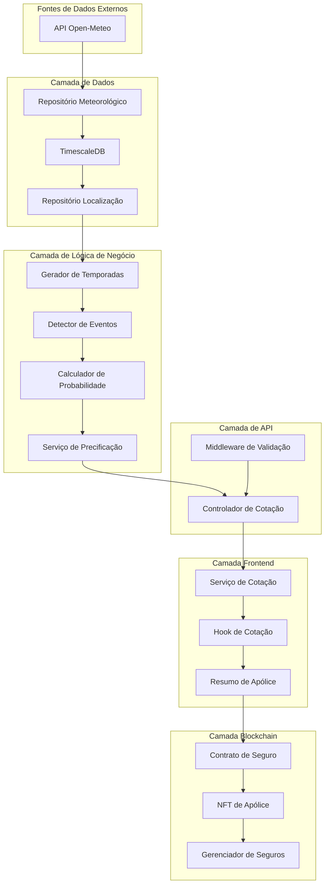
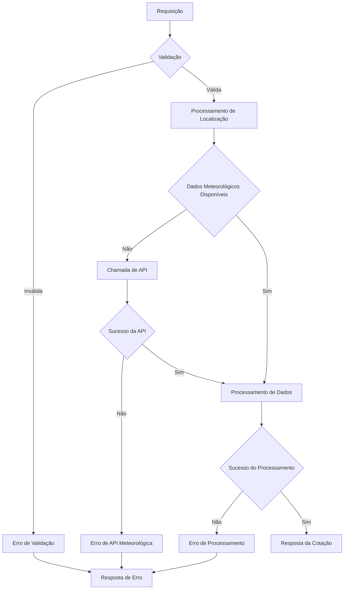

# AgroShield Serviço de Cotação - Documentação Técnica Completa

## Índice
1. [Visão Geral](#visão-geral)
2. [Arquitetura do Sistema](#arquitetura-do-sistema)
3. [Processamento de Dados Meteorológicos](#processamento-de-dados-meteorológicos)
4. [Cálculos de Probabilidade](#cálculos-de-probabilidade)
5. [Mecanismos de Avaliação de Risco](#mecanismos-de-avaliação-de-risco)
6. [Fluxo de Geração de Cotação](#fluxo-de-geração-de-cotação)
7. [Algoritmo de Precificação](#algoritmo-de-precificação)
8. [Esquema do Banco de Dados](#esquema-do-banco-de-dados)
9. [Integração com API](#integração-com-api)
10. [Integração com Smart Contracts](#integração-com-smart-contracts)
11. [Componentes Frontend](#componentes-frontend)
12. [Configuração e Parâmetros](#configuração-e-parâmetros)
13. [Otimizações de Performance](#otimizações-de-performance)
14. [Arquitetura de Fluxo de Dados](#arquitetura-de-fluxo-de-dados)

---

## Visão Geral

O Serviço de Cotação da AgroShield é um sistema de seguro paramétrico para culturas que gera cotações de seguro baseadas na análise de dados meteorológicos históricos, avaliação estatística de riscos e parâmetros de precificação configuráveis. O sistema fornece cotações de seguro precisas e em tempo real para culturas de soja e arroz, analisando 30 anos de dados meteorológicos para calcular a probabilidade de eventos climáticos adversos.

### Características Principais
- **Análise Histórica**: Análise de 30 anos de dados meteorológicos para precisão estatística
- **Processamento em Tempo Real**: Geração rápida de cotações com dados meteorológicos em cache
- **Rigor Estatístico**: Intervalos de confiança Wilson Score para estimativa de confiança
- **Modelos Específicos por Cultura**: Diferentes modelos de risco para soja e arroz
- **Precisão Geográfica**: Correspondência meteorológica baseada em coordenadas
- **Integração Blockchain**: Transição de cotação off-chain para política on-chain

---

## Arquitetura do Sistema

### Componentes Principais

```
┌─────────────────┐    ┌─────────────────┐    ┌─────────────────┐
│   Frontend      │    │   Servidor API  │    │  Smart Contract │
│   (React App)   │◄──►│   (Fastify)     │◄──►│   (Fuel/Sway)   │
└─────────────────┘    └─────────────────┘    └─────────────────┘
                                │
                                ▼
                       ┌─────────────────┐    ┌─────────────────┐
                       │  Domínio Central│    │  Acesso a Dados │
                       │  (Lógica de     │◄──►│  (APIs Clima &  │
                       │   Negócio)      │    │   Banco Dados)  │
                       └─────────────────┘    └─────────────────┘
                                                       │
                                                       ▼
                                              ┌─────────────────┐
                                              │   TimescaleDB   │
                                              │  (Dados Clima)  │
                                              └─────────────────┘
```

### Estrutura dos Módulos

**Domínio Central** (`packages/core-domain/`):
- Lógica de negócio pura sem dependências externas
- Algoritmos de detecção de eventos meteorológicos
- Métodos de cálculo de probabilidade
- Lógica do serviço de precificação

**Acesso a Dados** (`packages/data-access/`):
- Clientes de API meteorológica (Open-Meteo)
- Repositórios de banco de dados (TimescaleDB)
- Integrações com serviços externos

**Cliente GraphQL** (`packages/graphql-client/`):
- Cliente GraphQL para comunicação com indexer
- Configuração de endpoint e autenticação
- Gerenciamento de conexão GraphQL

**Consultas GraphQL** (`packages/graphql-queries/`):
- Hooks React para políticas e resgates
- Queries e mutations tipadas
- Integração com cache de dados

**Tipos GraphQL** (`packages/graphql-types/`):
- Tipos TypeScript gerados do schema GraphQL
- Configuração de geração de código
- Tipos compartilhados entre frontend e indexer

**Servidor API** (`apps/api-server/`):
- Servidor HTTP Fastify
- Endpoints REST para geração de cotações
- Validação de requisições e tratamento de erros

**Frontend** (`apps/app/`):
- Aplicação React com interface de cotação
- Exibição de cotações em tempo real e interação
- Integração com carteira Fuel para compra de apólices

**Indexer** (`apps/indexer/`):
- Indexer Envio para dados blockchain
- Processamento de eventos de contratos
- Exposição de API GraphQL para dados indexados

**Landing Page** (`apps/landing-page/`):
- Aplicação Next.js para página inicial
- Marketing e informações do produto
- Interface pública da AgroShield

---

## Processamento de Dados Meteorológicos

### Fontes de Dados

**Fonte Principal**: API Histórica Open-Meteo
- **Endpoint**: `https://archive-api.open-meteo.com/v1/archive`
- **Alcance Histórico**: 30 anos (1994-2024)
- **Resolução Geográfica**: Correspondência de coordenadas ±0.045°
- **Limitação de Taxa**: 60 requisições por minuto

### Variáveis Meteorológicas

O sistema coleta dados meteorológicos diários abrangentes:

```typescript
interface DadosMeteorologicos {
  temperature_2m_max: number;     // Temperatura máxima diária (°C)
  temperature_2m_min: number;     // Temperatura mínima diária (°C)
  precipitation_sum: number;      // Total de precipitação diária (mm)
  wind_speed_10m_max: number;     // Velocidade máxima do vento diária (km/h)
  weather_code: number;           // Classificação meteorológica WMO
}
```

### Pipeline de Processamento de Dados



1. **Gerenciamento de Localização**: Encontrar ou criar registro de localização por coordenadas
2. **Busca de Dados Históricos**: Recuperar dados meteorológicos faltantes do Open-Meteo
3. **Armazenamento de Dados**: Cache no TimescaleDB para otimização de performance
4. **Filtragem Sazonal**: Extrair períodos meteorológicos relevantes baseados nas temporadas das culturas

### Implementação do Cliente de API Meteorológica

**Localização**: `packages/data-access/src/weather/open-meteo/historical-client.ts`

```typescript
class ClienteHistoricoOpenMeteo {
  async obterDadosHistoricos(params: {
    latitude: number;
    longitude: number;
    dataInicio: string;
    dataFim: string;
  }): Promise<DadosMeteorologicos[]> {
    // Lógica de limitação de taxa e chamada de API
    // Transformação e validação de dados
    // Tratamento de erros e lógica de retry
  }
}
```

---

## Cálculos de Probabilidade

### Método Estatístico: Intervalo de Pontuação Wilson

O sistema usa o método Wilson Score para calcular probabilidade com intervalos de confiança de 95%. Este método fornece estimativas mais precisas que cálculos simples de proporção, especialmente para tamanhos de amostra pequenos.

**Fórmula Matemática**:
```
Wilson Score = (p̂ + z²/2n ± z√((p̂(1-p̂) + z²/4n)/n)) / (1 + z²/n)
```

Onde:
- `p̂` = proporção da amostra (eventos/temporadas totais)
- `z` = score z para 95% de confiança (1.96)
- `n` = tamanho da amostra (número de temporadas analisadas)

### Implementação

**Localização**: `packages/core-domain/src/weather/probability.ts`

```typescript
interface ResultadoProbabilidade {
  probability: number;    // Estimativa pontual
  lower: number;         // Limite inferior de confiança
  upper: number;         // Limite superior de confiança
  sampleSize: number;    // Número de temporadas analisadas
}

function calcularWilsonScore(
  sucessos: number, 
  tentativas: number
): ResultadoProbabilidade {
  const phat = sucessos / tentativas;
  const z = 1.96; // 95% de confiança
  const denominador = 1 + (z * z) / tentativas;
  
  const centro = phat + (z * z) / (2 * tentativas);
  const margem = z * Math.sqrt(
    (phat * (1 - phat) + (z * z) / (4 * tentativas)) / tentativas
  );
  
  return {
    probability: phat,
    lower: Math.max(0, (centro - margem) / denominador),
    upper: Math.min(1, (centro + margem) / denominador),
    sampleSize: tentativas
  };
}
```

### Geração de Temporadas

O sistema gera temporadas de cultivo específicas para os últimos 30 anos:

```typescript
interface TemporadaCultura {
  startDate: Date;    // Data de plantio
  endDate: Date;      // Data de colheita
  year: number;       // Identificador da temporada
}

function gerarTemporadas(
  mesPlantio: number,
  mesColheita: number,
  anos: number = 30
): TemporadaCultura[] {
  // Lidar com temporadas entre anos (ex: plantio Dez, colheita Mar)
  // Gerar intervalos de datas contínuas para cada temporada
  // Retornar array de objetos de temporada para análise
}
```

---

## Mecanismos de Avaliação de Risco

### Gatilhos de Eventos Meteorológicos

O sistema define eventos meteorológicos específicos que acionam pagamentos de seguro:

#### Eventos da Cultura de Soja

**Seca**:
- **Regra Principal**: 20 dias consecutivos com precipitação < 5mm
- **Verificação de Confirmação**: Validação adicional para casos limítrofes
- **Fundamentação**: Períodos secos prolongados durante fases críticas de crescimento

**Estresse por Calor**:
- **Regra**: 3 dias consecutivos com temperatura máxima > 40°C
- **Impacto**: Desnaturação de proteínas e redução de produtividade
- **Períodos Críticos**: Estágios de floração e formação de vagens

**Dano por Frio**:
- **Regra**: 3 dias consecutivos com temperatura mínima < 15°C E velocidade do vento > 15 km/h
- **Efeito Combinado**: Baixa temperatura mais fator de resfriamento pelo vento
- **Vulnerabilidade**: Crescimento inicial e estágios reprodutivos

**Enchente**:
- **Regra**: Soma de precipitação em 5 dias consecutivos > 150mm
- **Mecanismo**: Saturação do solo e dano às raízes
- **Detecção**: Análise de janela deslizante

#### Eventos da Cultura de Arroz

**Seca**:
- **Regra Principal**: 10 dias consecutivos com precipitação < 2mm
- **Confirmação**: Temperatura máxima > 35°C durante período seco
- **Necessidade de Água**: Alta dependência de água do arroz

**Estresse por Calor**:
- **Regra**: 3 dias consecutivos com temperatura máxima > 35°C E amplitude de temperatura < 8°C
- **Temperatura Noturna**: Impede recuperação do estresse térmico diurno
- **Período Crítico**: Estágio de enchimento de grãos

**Dano por Frio**:
- **Regra**: 4 dias consecutivos com temperatura mínima < 16°C
- **Sensibilidade**: Origem tropical do arroz e intolerância ao frio
- **Impacto**: Redução da fertilidade das espiguetas

**Enchente**:
- **Regra**: Soma de precipitação em 3 dias consecutivos > 120mm
- **Janela Menor**: Campos de arroz têm características de drenagem diferentes

### Algoritmo de Detecção de Eventos

**Localização**: `packages/core-domain/src/weather/detectors.ts`

```typescript
interface DetectorEventos {
  detectar(dadosMeteorologicos: DadosMeteorologicos[], temporada: TemporadaCultura): boolean;
}

class DetectorDiasConsecutivos implements DetectorEventos {
  constructor(
    private regra: (dia: DadosMeteorologicos) => boolean,
    private diasNecessarios: number,
    private verificacaoPos?: (periodo: DadosMeteorologicos[]) => boolean
  ) {}
  
  detectar(dadosMeteorologicos: DadosMeteorologicos[], temporada: TemporadaCultura): boolean {
    let diasConsecutivos = 0;
    let periodoGatilho: DadosMeteorologicos[] = [];
    
    for (const dia of dadosMeteorologicos) {
      if (this.regra(dia)) {
        diasConsecutivos++;
        periodoGatilho.push(dia);
        
        if (diasConsecutivos >= this.diasNecessarios) {
          if (!this.verificacaoPos || this.verificacaoPos(periodoGatilho)) {
            return true; // Evento detectado
          }
        }
      } else {
        diasConsecutivos = 0;
        periodoGatilho = [];
      }
    }
    
    return false;
  }
}
```

### Análise de Risco Multifatorial

1. **Frequência Histórica**: Período de retrospectiva de 30 anos para estabilidade estatística
2. **Precisão Geográfica**: Correspondência de dados meteorológicos baseada em coordenadas
3. **Tempo Sazonal**: Janelas de temporada personalizadas baseadas em meses de plantio/colheita
4. **Especificidade da Cultura**: Diferentes limites de gatilho para soja vs arroz
5. **Intervalos de Confiança**: Quantificação da incerteza estatística
6. **Persistência Temporal**: Requisitos de dias consecutivos previnem eventos isolados

---

## Fluxo de Geração de Cotação

### Endpoint da API

**Endpoint**: `POST /api/quotes`
**Handler**: `apps/api-server/src/controllers/quote.controller.ts`

### Esquema de Requisição

```typescript
interface RequisicaoCotacao {
  crop: 'soy' | 'rice';           // Tipo de cultura
  triggerEvent: EventId;          // Evento meteorológico a ser segurado
  areaHa: number;                 // Área da fazenda em hectares
  coveragePct: number;            // Porcentagem de cobertura (0-1)
  plantingMonth: number;          // Mês de plantio (1-12)
  harvestMonth: number;           // Mês de colheita (1-12)
  latitude: number;               // Latitude da fazenda
  longitude: number;              // Longitude da fazenda
}
```

### Processo Passo a Passo



1. **Validação de Requisição**: Validação de esquema usando Fastify JSON Schema
2. **Processamento de Localização**: Encontrar ou criar registro de localização por coordenadas
3. **Montagem de Dados Meteorológicos**: Verificar cache, buscar dados faltantes se necessário
4. **Geração de Temporadas**: Criar 30 temporadas de cultivo baseadas em meses de plantio/colheita
5. **Cálculo de Risco**: Aplicar detecção de eventos a cada temporada
6. **Análise Estatística**: Calcular probabilidade com intervalos de confiança
7. **Cálculo de Prêmio**: Aplicar fórmula de precificação com parâmetros de configuração
8. **Formatação de Resposta**: Retornar cotação estruturada com todos os dados relevantes

### Esquema de Resposta

```typescript
interface RespostaCotacao {
  probability: number;      // Probabilidade do evento (0-1)
  lower: number;           // Limite inferior de confiança
  upper: number;           // Limite superior de confiança
  LMI: number;            // Limite de Indenização Monetária
  premium: number;        // Valor total do prêmio
  sampleSize: number;     // Número de temporadas analisadas
}
```

---

## Algoritmo de Precificação

### Fórmula de Precificação Central

**Localização**: `packages/core-domain/src/pricing/service.ts`

```
Prêmio = Perda Esperada + Margem de Risco + Custo Operacional + Lucro do Projeto
```

Onde:
- **Perda Esperada** = Probabilidade × LMI (Limite de Indenização Monetária)
- **Margem de Risco** = 6% da Perda Esperada (buffer prudencial)
- **Custo Operacional** = 30% de carregamento para operações de negócio
- **Lucro do Projeto** = 15% de margem de lucro

### Implementação

```typescript
class ServicoPrecificacao {
  calcularPerdaEsperada(probabilidade: number, valorSegurado: number): number {
    return probabilidade * valorSegurado;
  }
  
  calcularPremio(
    probabilidade: number,
    areaHa: number,
    pctCobertura: number
  ): number {
    const LMI = areaHa * LMI_POR_HECTARE * pctCobertura;
    const perdaEsperada = this.calcularPerdaEsperada(probabilidade, LMI);
    
    const margemRisco = perdaEsperada * MARGEM_RISCO;
    const custoOps = perdaEsperada * CUSTO_OPS;
    const lucroprojeto = perdaEsperada * LUCRO_PROJETO;
    
    return perdaEsperada + margemRisco + custoOps + lucroprojeto;
  }
}
```

### Parâmetros de Precificação

De `apps/api-server/.env`:

```bash
RISK_MARGIN=0.06          # 6% buffer prudencial
OPS_COST=0.3              # 30% carregamento custo operacional
PROJECT_PROFIT=0.15       # 15% margem de lucro
LMI_PER_HECTARE=15000     # Cobertura base por hectare (BRL)
```

### Cálculo do LMI

```typescript
LMI = Área (ha) × LMI_POR_HECTARE × Porcentagem_Cobertura
```

Exemplo:
- Área da fazenda: 100 hectares
- Cobertura: 80%
- LMI por hectare: R$ 15.000
- **LMI Total**: 100 × 15.000 × 0,8 = **R$ 1.200.000**

---

## Esquema do Banco de Dados

### Implementação TimescaleDB

O sistema usa TimescaleDB para armazenamento otimizado de dados meteorológicos de séries temporais:

```sql
-- Tabela de localização
CREATE TABLE locations (
  id uuid PRIMARY KEY DEFAULT gen_random_uuid(),
  latitude double precision NOT NULL,
  longitude double precision NOT NULL,
  created_at timestamp with time zone DEFAULT now(),
  
  CONSTRAINT locations_lat_lng_key UNIQUE (latitude, longitude)
);

-- Hypertable de dados meteorológicos
CREATE TABLE weather_data (
  id uuid DEFAULT gen_random_uuid(),
  location_id uuid NOT NULL REFERENCES locations(id),
  day date NOT NULL,
  precipitation_sum double precision,
  temperature_2m_max double precision,
  temperature_2m_min double precision,
  wind_speed_10m_max double precision,
  weather_code integer,
  created_at timestamp with time zone DEFAULT now(),
  
  CONSTRAINT weather_data_pkey PRIMARY KEY (id, day)
);

-- Converter para hypertable para otimização de séries temporais
SELECT create_hypertable('weather_data', 'day');

-- Adicionar política de compressão
SELECT add_compression_policy('weather_data', INTERVAL '30 days');

-- Criar índices para consultas comuns
CREATE INDEX idx_weather_data_location_day 
ON weather_data (location_id, day DESC);

CREATE INDEX idx_weather_data_location_created 
ON weather_data (location_id, created_at DESC);
```

### Relacionamentos de Entidades

**Entidade Localização** (`packages/data-access/src/entities/location-entity.ts`):
```typescript
interface EntidadeLocalizacao {
  id: string;
  latitude: number;
  longitude: number;
  createdAt: Date;
}
```

**Entidade Dados Meteorológicos**:
```typescript
interface EntidadeDadosMeteorologicos {
  id: string;
  locationId: string;
  day: Date;
  precipitationSum: number | null;
  temperature2mMax: number | null;
  temperature2mMin: number | null;
  windSpeed10mMax: number | null;
  weatherCode: number | null;
  createdAt: Date;
}
```

---

## Integração com API

### Estrutura da API REST

**Framework**: Fastify com validação JSON Schema
**URL Base**: `/api/quotes`

### Definição do Endpoint

```typescript
// Handler da rota
fastify.post('/quotes', {
  schema: {
    body: EsquemaRequisicaoCotacao,
    response: {
      200: EsquemaRespostaCotacao
    }
  }
}, async (request, reply) => {
  const requisicaoCotacao = request.body as RequisicaoCotacao;
  
  try {
    const cotacao = await servicoCotacao.gerarCotacao(requisicaoCotacao);
    return cotacao;
  } catch (error) {
    reply.code(500).send({ error: 'Falha na geração de cotação' });
  }
});
```

### Esquema de Validação de Requisição

```typescript
const EsquemaRequisicaoCotacao = {
  type: 'object',
  required: [
    'crop', 'triggerEvent', 'areaHa', 'coveragePct',
    'plantingMonth', 'harvestMonth', 'latitude', 'longitude'
  ],
  properties: {
    crop: { type: 'string', enum: ['soy', 'rice'] },
    triggerEvent: { type: 'string' },
    areaHa: { type: 'number', minimum: 0.1, maximum: 10000 },
    coveragePct: { type: 'number', minimum: 0.1, maximum: 1.0 },
    plantingMonth: { type: 'integer', minimum: 1, maximum: 12 },
    harvestMonth: { type: 'integer', minimum: 1, maximum: 12 },
    latitude: { type: 'number', minimum: -90, maximum: 90 },
    longitude: { type: 'number', minimum: -180, maximum: 180 }
  }
};
```

### Tratamento de Erros

```typescript
class ServicoCotacao {
  async gerarCotacao(requisicao: RequisicaoCotacao): Promise<RespostaCotacao> {
    try {
      // Processamento de localização
      // Busca de dados meteorológicos
      // Cálculo de risco
      // Cálculo de prêmio
    } catch (error) {
      if (error instanceof ErroAPIMeteorologica) {
        throw new ErroGeracaoCotacao('Dados meteorológicos indisponíveis');
      }
      if (error instanceof ErroBancoDados) {
        throw new ErroGeracaoCotacao('Erro no armazenamento de dados');
      }
      throw error;
    }
  }
}
```

---

## Integração com Smart Contracts

### Arquitetura de Contratos

O sistema se integra com smart contracts da blockchain Fuel para gerenciamento de apólices:

**Contrato de Seguro** (`packages/contracts/insurance-contract/`):
- Criação e gerenciamento principal de apólices
- Processamento de pagamento de prêmios
- Lógica de execução de pagamentos

**Gerenciador de Seguros** (`packages/contracts/insurance-manager/`):
- Rastreamento de status de apólices
- Registro e validação de eventos
- Coordenação de processamento de sinistros

**NFT de Seguro** (`packages/contracts/insurance-nft/`):
- Representação NFT de apólices
- Armazenamento e recuperação de metadados
- Gerenciamento de transferência e propriedade

### Integração com Indexer

O **Indexer Envio** (`apps/indexer/`) processa eventos dos contratos e expõe dados via GraphQL:

- **Processamento de Eventos**: Monitora eventos de criação, atualização e pagamento de apólices
- **API GraphQL**: Expõe dados indexados para consulta pelo frontend
- **Sincronização**: Mantém dados sincronizados com estado da blockchain
- **Performance**: Cache e otimização de consultas para dados históricos
- **Integração Frontend**: Usado pelos pacotes `graphql-client`, `graphql-queries` e `graphql-types`

### Fluxo de Cotação para Apólice



1. **Cotação Off-chain**: Avaliação de risco e cálculo de prêmio
2. **Aceitação do Usuário**: Frontend confirma aceitação da cotação
3. **Criação de Apólice**: Smart contract cria apólice com parâmetros da cotação
4. **Pagamento de Prêmio**: Usuário paga valor calculado do prêmio
5. **Mintagem de NFT**: Apólice representada como NFT transferível
6. **Registro no Gerenciador**: Apólice registrada para processamento automatizado de sinistros

### Estrutura de Dados da Apólice

```sway
struct DadosApolice {
    id: u64,
    holder: Identity,
    crop_type: TipoCultura,
    trigger_event: TipoEvento,
    area_ha: u64,
    coverage_pct: u64,
    lmi: u64,
    premium: u64,
    planting_month: u8,
    harvest_month: u8,
    latitude: i64,
    longitude: i64,
    created_at: Timestamp,
    status: StatusApolice,
}
```

---

## Componentes Frontend

### Hook de Cotação

**Localização**: `apps/app/src/hooks/useQuote.ts`

```typescript
export function useQuote() {
  return useMutation({
    mutationFn: async (requisicao: RequisicaoCotacao) => {
      const response = await fetch('/api/quotes', {
        method: 'POST',
        headers: { 'Content-Type': 'application/json' },
        body: JSON.stringify(requisicao)
      });
      
      if (!response.ok) {
        throw new Error('Falha na geração de cotação');
      }
      
      return response.json() as RespostaCotacao;
    },
    onSuccess: (data) => {
      // Lidar com geração de cotação bem-sucedida
    },
    onError: (error) => {
      // Lidar com erros de geração de cotação
    }
  });
}
```

### Componente Resumo da Apólice

**Localização**: `apps/app/src/components/policy/PolicySummary.tsx`

Características:
- Exibição de cotação em tempo real com estados de carregamento
- Visualização de detalhamento do prêmio
- Exibição de probabilidade com intervalos de confiança
- Ajuste interativo de parâmetros de cotação
- Integração de compra de apólice com carteira Fuel

```typescript
interface PropsResumoApolice {
  quote: RespostaCotacao;
  onPurchase: () => void;
  loading: boolean;
}

export function PolicySummary({ 
  quote, 
  onPurchase, 
  loading 
}: PropsResumoApolice) {
  return (
    <div className="resumo-apolice">
      <div className="exibicao-probabilidade">
        <span>Probabilidade do Evento: {(quote.probability * 100).toFixed(2)}%</span>
        <span>Intervalo de Confiança: {(quote.lower * 100).toFixed(2)}% - {(quote.upper * 100).toFixed(2)}%</span>
      </div>
      
      <div className="detalhamento-premio">
        <span>Limite de Cobertura: R$ {quote.LMI.toLocaleString()}</span>
        <span>Prêmio: R$ {quote.premium.toLocaleString()}</span>
      </div>
      
      <button onClick={onPurchase} disabled={loading}>
        {loading ? 'Processando...' : 'Comprar Apólice'}
      </button>
    </div>
  );
}
```

### Camada de Serviço de Cotação

**Localização**: `apps/app/src/services/quote/`

```typescript
export class ServicoCotacao {
  private client: AxiosInstance;
  
  constructor(baseURL: string) {
    this.client = axios.create({ baseURL });
  }
  
  async gerarCotacao(requisicao: RequisicaoCotacao): Promise<RespostaCotacao> {
    const response = await this.client.post<RespostaCotacao>('/quotes', requisicao);
    return response.data;
  }
}
```

---

## Configuração e Parâmetros

### Variáveis de Ambiente

**Servidor API** (`apps/api-server/.env`):
```bash
# Configuração de Precificação
RISK_MARGIN=0.06              # 6% buffer de risco
OPS_COST=0.3                  # 30% custo operacional
PROJECT_PROFIT=0.15           # 15% margem de lucro
LMI_PER_HECTARE=15000         # Cobertura por hectare (BRL)

# Configuração API Meteorológica
OPEN_METEO_RATE_LIMIT=60      # Requisições por minuto
OPEN_METEO_BASE_URL=https://archive-api.open-meteo.com

# Configuração Banco de Dados
DB_NAME=agroshield
DB_HOST=localhost
DB_PORT=5432
DB_USER=postgres
DB_PASSWORD=password

# Configuração CORS
CORS_ORIGIN=http://localhost:3000
```

---

## Otimizações de Performance

### Otimizações TimescaleDB

1. **Particionamento de Hypertable**: Particionamento automático por dia para consultas de séries temporais
2. **Compressão**: Compressão automática após 30 dias reduz armazenamento em 90%
3. **Estratégia de Indexação**: Índices otimizados para consultas localização-data
4. **Otimização de Consultas**: Padrões de consulta específicos para séries temporais

```sql
-- Política de compressão
SELECT add_compression_policy('weather_data', INTERVAL '30 days');

-- Política de retenção (opcional)
SELECT add_retention_policy('weather_data', INTERVAL '10 years');

-- Índice para padrões de consulta comuns
CREATE INDEX idx_weather_location_day_desc 
ON weather_data (location_id, day DESC);
```

### Estratégia de Cache

1. **Cache de Dados Meteorológicos**: Armazenamento persistente no TimescaleDB
2. **Cache de Localização**: Reutilização de localização baseada em coordenadas
3. **Limitação de Taxa de API**: Uso eficiente de APIs meteorológicas externas
4. **Otimização de Consultas**: Operações em lote para análise de temporadas

### Otimizações de Algoritmos

1. **Operações Vetorizadas**: Processamento em lote de dados meteorológicos
2. **Terminação Antecipada**: Parar detecção de eventos quando limite de gatilho é atingido
3. **Eficiência de Memória**: Processamento em streaming para grandes conjuntos de dados
4. **Processamento Paralelo**: Análise concorrente de temporadas quando possível

---

## Arquitetura de Fluxo de Dados

### Fluxo Completo de Dados do Sistema



### Fluxo de Processamento de Requisições

1. **Requisição de Cotação**: Frontend submete parâmetros de cotação
2. **Validação**: API valida esquema de requisição e parâmetros
3. **Processamento de Localização**: Encontrar ou criar registro de localização
4. **Recuperação de Dados**: Verificar cache, buscar dados meteorológicos faltantes
5. **Análise de Temporadas**: Gerar 30 anos de temporadas de cultivo
6. **Detecção de Eventos**: Aplicar regras de gatilho a cada temporada
7. **Cálculo de Risco**: Calcular probabilidade com intervalos de confiança
8. **Cálculo de Prêmio**: Aplicar fórmula de precificação com configuração
9. **Resposta**: Retornar cotação estruturada para frontend
10. **Criação de Apólice**: Usuário pode converter cotação em apólice blockchain

### Fluxo de Tratamento de Erros



---

## Conclusão

O Serviço de Cotação da AgroShield representa um sistema de seguro paramétrico que combina:

- **Métodos Estatísticos Avançados**: Intervalos Wilson Score para estimativa robusta de probabilidade
- **Análise Meteorológica Abrangente**: 30 anos de dados históricos com gatilhos específicos por cultura
- **Arquitetura de Alta Performance**: Otimização TimescaleDB para dados de séries temporais
- **Processamento em Tempo Real**: Geração rápida de cotações com cache inteligente
- **Integração Blockchain**: Transição perfeita de cotação para apólice
- **Código Pronto para Produção**: Tratamento abrangente de erros e validação

Este sistema fornece cotações de seguro precisas e estatisticamente sólidas, mantendo excelente performance e experiência do usuário. A arquitetura modular garante manutenibilidade e extensibilidade para melhorias futuras.

### Principais Conquistas Técnicas

1. **Rigor Estatístico**: Cálculos atuariais de nível profissional
2. **Performance**: Geração de cotações em menos de um segundo para análise complexa de riscos
3. **Escalabilidade**: TimescaleDB lida com milhões de pontos de dados meteorológicos
4. **Precisão**: Modelos específicos por cultura com precisão geográfica
5. **Integração**: Criação perfeita de apólices blockchain a partir de cotações
6. **Manutenibilidade**: Arquitetura limpa com separação de responsabilidades

O serviço de cotação forma a base da plataforma de seguro paramétrico da AgroShield, permitindo que os agricultores recebam precificação precisa e justa para seguro agrícola baseado em dados meteorológicos objetivos e análise estatística rigorosa.